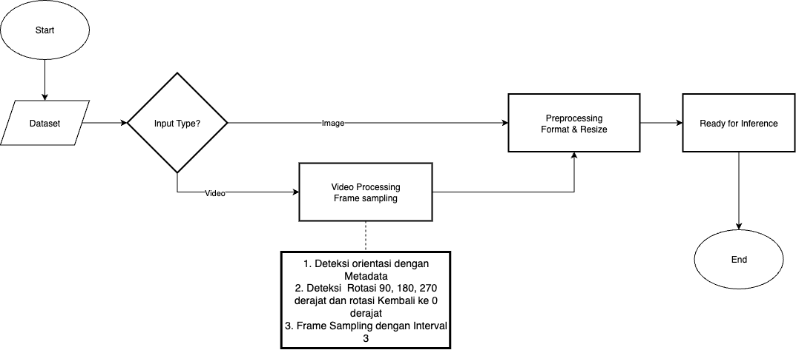

# 🏁 Tugas Akhir (TA) - Final Project

**Nama Mahasiswa**: Adam Haidar Azizi  
**NRP**: 5025211114
**Judul TA**: Sistem Deteksi Postur Duduk Ergonomis Menggunakan Movenet dan LSTM 
**Dosen Pembimbing**: Adhatus Solichah Ahmadiyah 


---

## 📺 Demo Aplikasi  
 

[](https://www.youtube.com/watch?v=3bHdVgmQ3Mo)  
*Klik gambar di atas untuk menonton demo*

---

*Konten selanjutnya hanya merupakan contoh awalan yang baik. Anda dapat berimprovisasi bila diperlukan.*

## 🛠 Panduan Instalasi & Menjalankan Software  

### Prasyarat  
- Daftar dependensi yang dibutuhkan (Akan Diinstall secara otomatis dengan menjalankan install.sh):
  - **Python 3.9+** (akan diinstall otomatis jika belum tersedia)
  - **Ubuntu/Debian Linux** (untuk apt-get package manager)
  - **Sudo privileges** (untuk instalasi system packages)
  
- System dependencies yang akan diinstall otomatis:
  - OpenCV development libraries
  - FFmpeg (untuk video processing)
  - Git
  - Build tools (gcc, make, etc.)
  
- Python packages yang akan diinstall otomatis:
  - TensorFlow & TensorFlow Hub (untuk MoveNet model)
  - Flask ecosystem (flask, flask-cors, flask-socketio)
  - Scientific computing (numpy, pandas, scipy, scikit-learn)
  - Computer vision (opencv-python)
  - Visualization (matplotlib)
  - Utilities (joblib, imageio, tqdm, eventlet)

### Langkah-langkah  
1. **Clone Repository**  
   ```bash
   git clone https://github.com/Informatics-ITS/ta-HADAIZI.git
   cd ta-HADAIZI
   ```
2. **Instalasi Dependensi**
   ```bash
   # Jalankan script instalasi otomatis
   chmod +x install.sh
   ./install.sh
   ```
3. **Persiapan Model dan Data**
   - Pastikan folder `modelv4/` berisi model LSTM yang sudah dilatih
   - Pastikan folder `movenet_models/` berisi model MoveNet
   - Siapkan file test:
   ```bash
   mkdir -p test
   # Masukkan gambar (.jpg, .png) atau video (.mp4, .avi) ke folder test/
   ```
## Usage Options

### Option 1: Standalone Analysis (Simplier)

**4a. Jalankan Analisis Lokal**
```bash
# Test semua file (gambar dan video) di folder test/
python3 test.py
```

**5a. Hasil Analisis**
- Script akan memproses semua file di folder `test/`
- Hasil visualisasi disimpan di folder `test_output_visualizations/`
- Hasil JSON dengan detail analisis (REBA score, sudut joint, dll.) tersimpan otomatis
- File zip berisi semua hasil akan dibuat untuk kemudahan akses

### Option 2: Web Server (Optional)

**4b. Jalankan Web Server**
```bash
python3 run.py
```

**5b. Testing API dengan Postman**
Server akan berjalan di `http://localhost:5050`. Gunakan Postman untuk testing:

**API Endpoint 1: Analisis Gambar**
- **Method**: `POST`
- **URL**: `http://localhost:5050/predict/image`
- **Body**: Form-data
  - Key: `image` (type: File)
  - Value: Upload file gambar (.jpg, .png)
- **Response**: JSON dengan REBA score, component scores, dan path visualisasi

**API Endpoint 2: Analisis Video**
- **Method**: `POST` 
- **URL**: `http://localhost:5050/predict/video`
- **Body**: Form-data
  - Key: `video` (type: File)
  - Value: Upload file video (.mp4, .avi)
- **Response**: JSON dengan job_id untuk tracking progress

**API Endpoint 3: Cek Status Video Job**
- **Method**: `GET`
- **URL**: `http://localhost:5050/job/{job_id}`
- **Response**: Status pemrosesan dan hasil jika selesai

**API Endpoint 4: Download Visualisasi**
- **Method**: `GET`
- **URL**: `http://localhost:5050/output_images/{path}`
- **Response**: File gambar hasil visualisasi

**Contoh Response Gambar:**
```json
{
  "result": {
    "reba_score": 3.2,
    "risk_level": "Medium Risk",
    "component_scores": {
      "neck_score": 2,
      "trunk_score": 3,
      "upper_arm_score": 2
    },
    "visualization_path": "2024-01-15/analysis_123456.png"
  }
}
```

## Important Notes

**Untuk Standalone Analysis:**
- Tidak perlu menjalankan server Flask - test.py bekerja secara standalone
- Script akan otomatis mendeteksi dan memproses semua gambar dan video di folder test/
- **Untuk video processing**, ada 2 opsi yang akan ditampilkan:
  
  ```
  Video Processing Options:
  1. Process videos as single segments (faster)
  2. Process videos with 5-minute segmentation (detailed)
  Enter choice (1 or 2): [pilih 1 atau 2]
  ```
  
  **Opsi 1 - Single Segment (Recommended untuk testing):**
  - Video diproses sebagai satu kesatuan
  - Lebih cepat, cocok untuk video pendek (<10 menit)
  - Hasil: 1 file analisis per video
  
  **Opsi 2 - Segmented Processing (Untuk video panjang):**
  - Video dipotong otomatis menjadi segment 5 menit
  - Setiap segment dianalisis terpisah
  - Input durasi custom: sistem akan tanya "Enter segment duration in minutes (default 5):"
  - Hasil: Multiple file analisis per segment + summary gabungan
  - Berguna untuk video >15 menit atau analisis temporal yang detail

- Semua hasil analisis tersimpan dalam format JSON

**Untuk Web Server:**
- Aplikasi akan otomatis membuat folder `temp_jobs/`, `output_images/`, dan `logs/`
- Untuk server production, ganti `debug=True` menjadi `debug=False` di `run.py`

**General:**
- Script install.sh akan otomatis menangani semua instalasi dependencies
- Jika Python version < 3.9, script akan compile Python 3.9 dari source 
- Semua folder yang dibutuhkan akan dibuat otomatis
- SSL support akan dikonfigurasi otomatis untuk TensorFlow Hub downloads

---

## 📚 Dokumentasi Tambahan

<div align="center">




</div>


---

## Pertanyaan??

Hubungi:
- Penulis: adamhadaizi20002@gmail.com
- Pembimbing Utama: adhatus@if.its.ac.id
